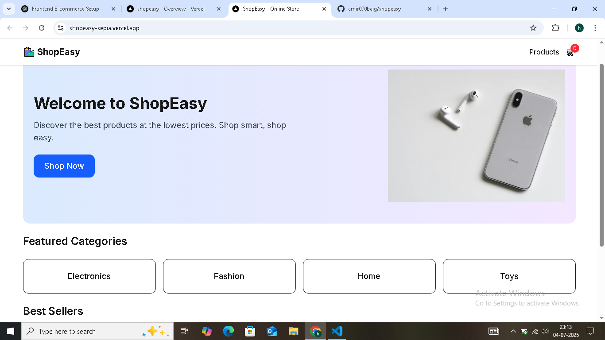
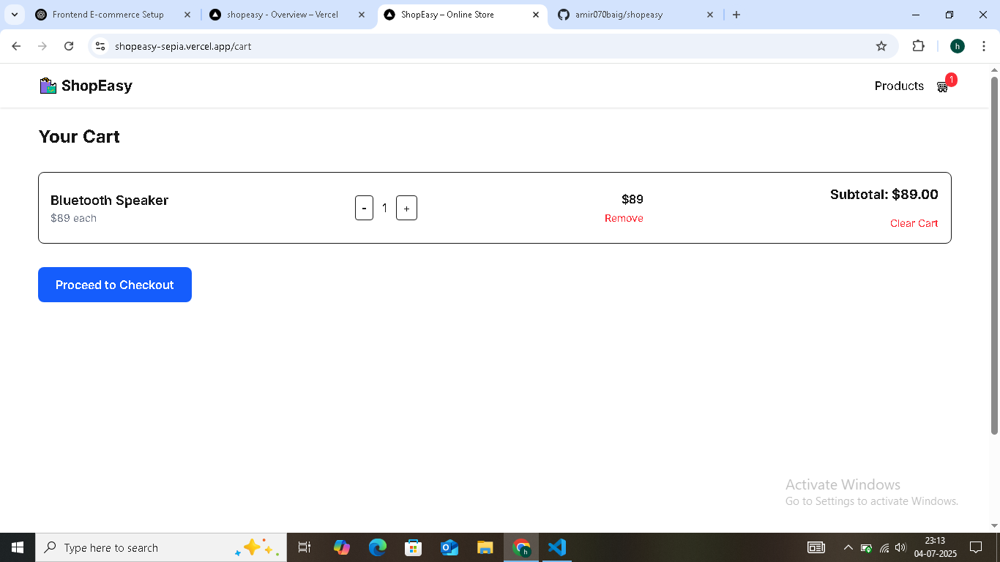
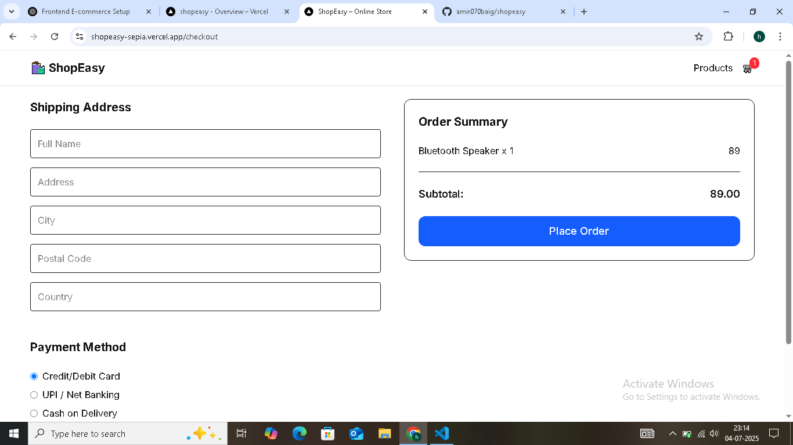

# 🛍️ ShopEasy – Modern E-commerce Frontend

A fully responsive and production-ready e-commerce frontend built with:

- ⚛️ **Next.js** (App Router, SSR)
- 💨 **Tailwind CSS** (utility-first styling)
- 🔐 **TypeScript** (type-safe)
- 🧠 **Redux Toolkit** (global cart state management)

> 🚀 Live Demo: [shopeasy.vercel.app](https://shopeasy-sepia.vercel.app/checkout)

---

## ✨ Features

✅ Beautiful homepage with hero, categories, best sellers  
✅ Product listing page with filters and pagination  
✅ Dynamic product detail page  
✅ Add to cart, increase/decrease quantity  
✅ Real-time subtotal + responsive cart page  
✅ Checkout page with address and payment method (UI only)  
✅ Toast notifications (add to cart etc.)  
✅ 100% Responsive Design  
✅ Built with performance, type safety and scalability in mind  

---

## 📸 Screenshots

### 🖥️ Desktop

---

## 📂 Tech Stack

- [x] **Next.js (App Router)**
- [x] **React**
- [x] **Redux Toolkit**
- [x] **Tailwind CSS**
- [x] **TypeScript**
- [x] **Vercel** (for deployment)

---

## 📚 What I Learned

- Efficient state management using Redux Toolkit
- Modular, scalable frontend structure using Next.js App Router
- Advanced Tailwind CSS layouting & responsive design
- Real-world cart logic and dynamic routing
- Using Vercel to instantly deploy React projects

---

## 🧠 Future Improvements

- Connect to Firebase/Stripe or node backend for full checkout
- Add real filters + sort logic
- User authentication
- Wishlist / Orders history

---

## 🧑‍💼 About Me

Hi, I’m **Mohd Amir**, a frontend developer passionate about building modern and scalable web apps.

📧 Email: your.email@example.com  
🔗 [LinkedIn](www.linkedin.com/in/mohd-amir-baig-394243369)  
🐱 [GitHub](https://github.com/amir070baig)

---

## 📎 License

This project is open-source. Feel free to fork and customize.
